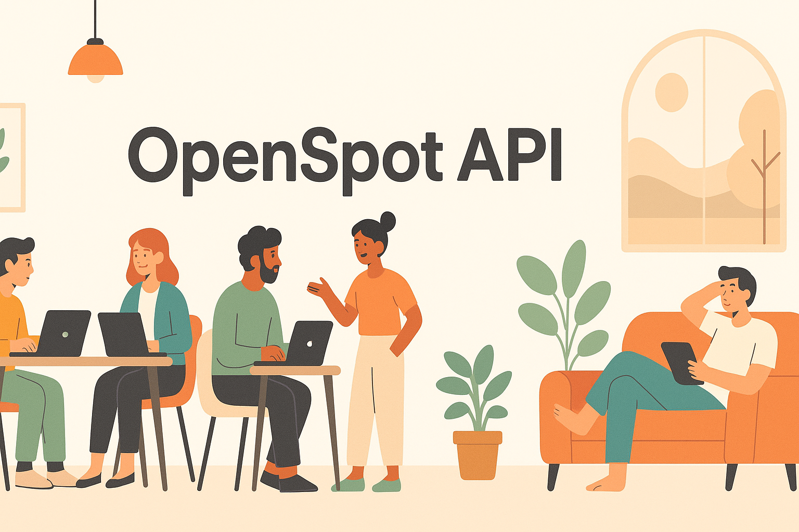

# OpenSpot API

***Corporate perks, without the stuffy corporate office.***

The OpenSpot API lets developers access real-time data for coworking and coliving paces around the world. You can retrieve details like location, pricing, capacity, and current availability to help users find and book flexible workspaces anywhere. Designed for seamless integration, OpenSpot makes it easy to power the future of remote work and living.

This mock API behaves like a real backend service, allowing you to test endpoints, build your frontend, and practice making HTTP requests—even though the real OpenSpot backend does not exist yet.

## Helpful resources

* **[Getting Started](overview/getting-started.md)**  
  Learn how to install Node.js, set up the JSON Server, and run your first API request.

* **[Tutorials](tutorials/)**  
  Step-by-step guides that walk you through common tasks like adding a new space or checking availability.

* **[API Reference Guide](api-reference/api-reference-guide.md)**  
  A complete list of resources and endpoints, ideal for quick lookup or advanced users.

## Who is this API for?

The OpenSpot API is built for developers who want to integrate coliving and coworking data into their applications. Whether you're building:

* A booking platform for coliving spaces

* A tool to support remote teams or satellite offices

* A workspace discovery app for freelancers or small business owners  

OpenSpot gives you structured, queryable access to global workspace data.

## Common use cases

* You're starting your small business, and need to separate your living space from your working space as you grow.

* Your company wants to build an app that helps remote employees find coworking locations for temporary satellite offices.

## Support

If you have any questions, or if you need assistance, feel free to contact our **Support Team**.

## Related pages

* [Spaces resource](../openspot-api/docs/api-reference/spaces.md)

* [Availability resource](../openspot-api/docs/api-reference/availablility.md)
