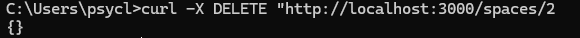

In this tutorial, you'll learn how to remove a space object in the OpenSpot API JSON mock database. In order to remove a space, you'll need to use the `DELETE` HTTP method.

The `DELETE` method removes a `space` object from the `spaces` array. This is useful when you need remove coworking or coliving space that is off the market or in need of repairs before you list it again.

You can reasonably expect this tutorial to take about 10 minutes or less to complete.

## Before you start

Make sure you have set up your database environment by following the steps in the [Set up your server](../overview/getting-started.md) guide.

You will also need to download and use [Postman](https://www.postman.com/downloads/). You can optionally use cURL, however, Postman for `POST` calls are generally more intuitive.

## Delete a space

Follow the steps below to delete a space.

### cURL example

1. Open a CLI (command line interface) and enter the following command:

    `curl -X DELETE "http://localhost:3000/spaces/2"`

1. Hit **Enter** to run the command.

    

1. To verify the record was delete run the following command:

    `curl "http://localhost:3000/spaces"`

    

As you can see from the screenshots above, the space with ID 2, has been removed from the database.

### Postman example

1. Open an instance of Postman and create a new Request by clicking the **'+'**.

1. Select **DELETE** from the dropdown.

1. Enter the following URL into the URL field:

    `http://localhost:3000/spaces/2`

1. Click **SEND**.

    

You have now successfully deleted a space from the OpenSpot API mock database.

!!! note
    When you delete a space, its linked availability record is also deleted. This prevents leftover availability data from remaining in the database. So in this tutorial we deleted "space 2" which also deleted "availability 2" since "availability 2" was associated with the space ID of 2.

```json
    {
    "id": 2,
    "spaceId": 2,
    "availableSpots": 10,
    "date": "2025-12-10"
}
```

## Additional resources

[DELETE spaces](/docs/api-reference/spaces/delete-space.md)
