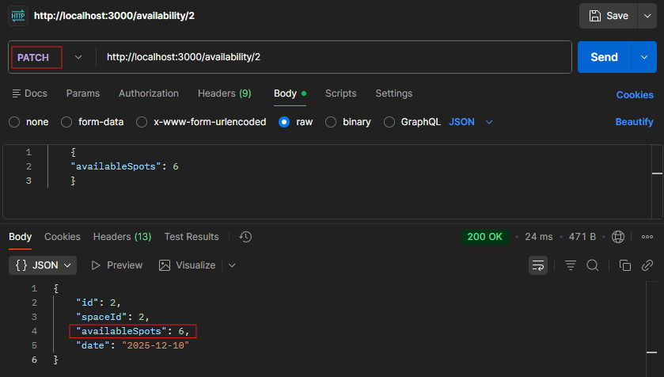

In this tutorial, you'll learn how to partially update an availability object in the OpenSpot API JSON mock database. In order to only update a single or subset of properties for a resource instance, you'll need to use the `PATCH` HTTP method.

The `PATCH` method modifies specified user-defined properties and updates the `availability` object. This is useful when you need to update only the available spots left without modifying other properties.

You can reasonably expect this tutorial to take about 10 minutes or less to complete.

## Before you start

Make sure you have set up your database environment by following the steps in the [Set up your server](../overview/getting-started.md) guide.

You will also need to download and use [Postman](https://www.postman.com/downloads/). You can optionally use cURL, however, Postman for `POST` calls are generally more intuitive. Since you will be entering **body** information, the formatting is more simple in Postman as opposed to cURL in the CLI.

## Update availability

1. Open an instance of Postman and create a new Request by clicking the **'+'**.

1. Select **PATCH** from the dropdown.

1. Enter the following URL into the URL field:

    `http://localhost:3000/availability/2`

1. Select the **Body** tab and select the **raw** radio button.

1. Enter the following body information:

   ```json
    {
        "availableSpots": 6
    },
    ```

1. Click **Send**.

    

    

As you can see from the screenshots, "availability record 2" originally showed 10 available spots. After applying the PATCH request, the record updated to 6 available spots without altering the date or IDs.

!!! note
    If you had used the PUT method instead, JSON Server would have replaced the entire object, removing any properties not included in your request (such as the date field).

## Additional resources

[PATCH /availability](../api-reference/availability/patch-availability.md)
